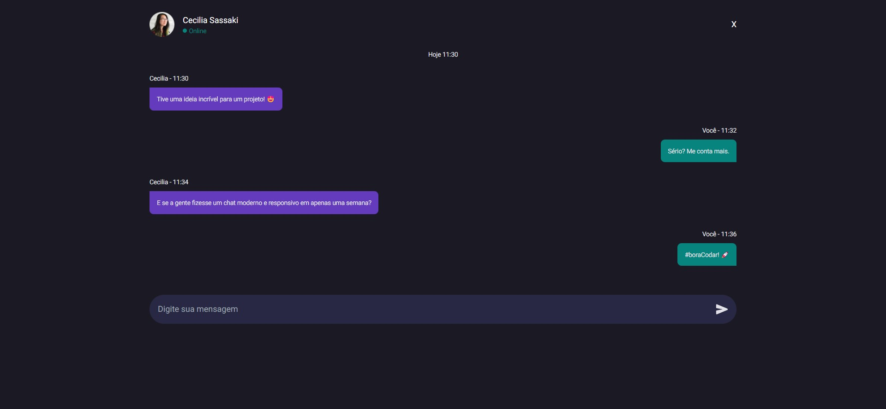

 

<h1 align="center">Chat desafio</h1>

<!-- ABOUT THE PROJECT -->
## Sobre esse projeto

O projeto chat foi criado através do desafio proposto pela comunidade da <a href="https://www.rocketseat.com.br/">Rocketseat</a>, recriar um app de conversas com qualquer ferramenta.

### Criado com:

Ferramentas:  

1. HTML5
2. Tailwindcss
3. Figma

<!-- GETTING STARTED -->
## Visualizar 

### Pré-visualização

Você pode visualizar o site clicando no link abaixo.

[Ver site](https://ericodesenvolvedor.github.io/chat-desafio/)

### Figma

Você pode visualizar o figma do projeto clicando abaixo

[Ver figma](https://www.figma.com/community/file/1200070743637495660)

<!-- CONTACT -->
## 📫 Contato

Instagram - [@ericodesenvolvedor](https://instagram.com/ericodesenvolvedor/)

Linkedin: [Eric Oliveira](https://www.linkedin.com/in/eric-de-oliveira-pereira/)